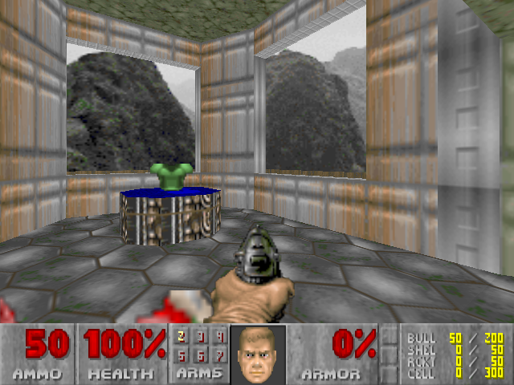

# DooMC0re

DOOM running as native x86_64 shellcode on PS5 through the
[LuaC0re](https://github.com/Gezine/Luac0re) JIT exploit.

Built on my [EmuC0re](https://github.com/egycnq/EmuC0re) — full homebrew apps built and run from PS5 userland,
no kernel exploit needed.

The engine is [doomgeneric](https://github.com/ozkl/doomgeneric), the
portable cut of Chocolate Doom. Everything under `src/` outside
`src/doomgeneric/` is the PS5 side: video, audio, pad, FTP, savedata and
netgame.

No game data is included. You need an IWAD: the Doom shareware `doom1.wad`,
Freedoom, or a retail Doom, Doom II or Final Doom WAD you own.

## What you need

- A PS5 with LuaC0re set up and its remote loader listening on port 9026.
- A PC on the same network with Python 3.
- To build: gcc, binutils, make and python3 on Linux or WSL.

## Build

    make                 # single player, writes doom.lua
    make MULTIPLAYER=1   # with the Chocolate Doom netgame code

## Run

Start the log listener first. It is the only diagnostic channel there is:

    python udp_log.py 9027 doom_test.log

Then send the payload:

    python doom_launcher.py <PS5_IP>

The launcher works out which of this PC's addresses the console can reach
and writes it into the payload as the log target. `--log-ip` overrides that.

### WADs

`python doom_launcher.py <PS5_IP> -ftp` sends everything in `wads/`, or in
`-ftp <folder>`, after launching. The console opens its FTP server on port
1337 when it finds no WADs, or when you press R1 on the WAD list. Any FTP
client works too; `SITE EXIT` closes the server and rescans.

The WAD list identifies each file and refuses PWADs and WADs missing lumps
the engine needs. With exactly one usable WAD it boots straight into it.

### Controls

| Pad         | In game               | In menus   |
| ----------- | --------------------- | ---------- |
| Left stick  | move, strafe          |            |
| Right stick | turn                  |            |
| D-pad       | move, turn            | navigate   |
| Cross       | fire                  | select     |
| Circle      | use                   | back       |
| Square, R2  | strafe                |            |
| L2          | run                   |            |
| L1, R1      | previous, next weapon |            |
| Triangle    | automap               |            |
| Options     | menu                  | close menu |

Saves go to the emulator's savedata container and survive a relaunch.

## Multiplayer

Build with `MULTIPLAYER=1` and hold Triangle while the WAD loads. The network
menu picks host or join, the address to join, the player count (2 to 4),
co-op or deathmatch or deathmatch 2.0, and the skill. `doom_launcher.py
--connect <ip>` presets the address so it does not have to be typed in
on the pad.

The console speaks the stock Chocolate Doom 3.0 protocol, so it is just
another node and any mix works:

- **Two, three or four PS5s.** One hosts, the rest join its address.
- **PS5s and PCs together**, in any combination, either side hosting.

Every node needs the identical IWAD file or the checksums disagree and
the game will not start. Only the host's player count, game type and skill
count for anything; the join menu still shows those rows, but a joiner's
settings are discarded once it connects.

    chocolate-doom -iwad doom2.wad -privateserver -deathmatch -nodes 2   # PC hosts
    chocolate-doom -iwad doom2.wad -connect <ps5 ip>                     # PS5 hosts

When the PC hosts, join within 30 seconds of starting it. Chocolate Doom
3.0.x drops any client that connects later — an upstream bug fixed after
3.0.1, so a newer build has no such limit. Hosting from the console is not
affected.

### Online play

You can join public internet games. The console cannot search for them
itself — there is no server list in the menu, and the payload has no DNS
resolver, so it could not query `master.chocolate-doom.org` even if there
were — but it does not need to, because the master server's own listing at
[master.chocolate-doom.org](https://master.chocolate-doom.org/) publishes
every server as a numeric IPv4 address and port, which is exactly what the
console takes. Open it on a phone or a PC, pick a server running an IWAD
you have, and give the console its address:

    python doom_launcher.py <PS5_IP> --connect 203.0.113.45:2342

Listed ports are usually 2342 but run up to 2347. The pad can only type
the four octets of an address, so anything on a non-default port has to be
preset with `--connect <ip>:<port>` rather than entered on the console.

Hosting works the other way round only as a private game: a console always
starts its server with `-privateserver`, so it is never announced on the
master server and nobody can find it by browsing. Players join it by
address, which over the internet means forwarding UDP 2342 to the console
and handing out your public address.

## Layout

    src/              PS5 platform layer
    src/doomgeneric/  the engine, from doomgeneric
    make_payload.py   turns doom.elf into doom.lua
    doom_launcher.py  sends the payload, uploads WADs
    udp_log.py        log listener

## Credits

- [Gezine](https://github.com/Gezine/Luac0re) — LuaC0re framework and JIT exploit
- [CTurt](https://github.com/CTurt) —
  [mast1c0re](https://cturt.github.io/mast1c0re.html) writeup
- [McCaulay](https://github.com/McCaulay) —
  [mast1c0re](https://mccaulay.co.uk/mast1c0re-part-2-arbitrary-ps2-code-execution/)
  writeup and [Okage](https://github.com/McCaulay/mast1c0re) reference
  implementation
- [ChampionLeake](https://github.com/ChampionLeake) — PS2 _Star Wars Racer
  Revenge_ exploit writeup on
- [Abkarino](https://github.com/AbkarinoMHM)  
  [psdevwiki](https://www.psdevwiki.com/ps2/Vulnerabilities)
- [shahrilnet](https://github.com/shahrilnet/remote_lua_loader) &
  [null_ptr](https://github.com/n0llptr) — code references from
  [remote_lua_loader](https://github.com/shahrilnet/remote_lua_loader)

DOOM itself:

- id Software — DOOM
- [Chocolate Doom](https://github.com/chocolate-doom/chocolate-doom) — the
  source port the engine comes from, by Simon Howard and contributors
- [doomgeneric](https://github.com/ozkl/doomgeneric) by ozkl — the portable
  cut of Chocolate Doom this port plugs into

## License

The project as a whole is GPL-2.0-or-later; see LICENSE. The engine is
doomgeneric (GPL-2.0), built on Chocolate Doom (GPL-2.0-or-later), Copyright
id Software and Simon Howard. `src/doomgeneric/sha1.c` comes from GnuPG under
GPL-3.0-or-later and is linked into every build, so a binary built from this
tree is effectively distributed under the terms of GPL version 3.

The PS5 platform layer was written for this port and does not derive from the
engine, so those files are also offered under the MIT license in LICENSE-MIT:
you can take such a file on its own under either GPL-2.0-or-later or MIT. The
exceptions are the files that implement or adapt engine code, which stay
GPL-2.0-or-later only: `dg_main.c`, `dg_platform.c`, `dg_sound.c`,
`dg_musicmod.c`, `dg_music.c` and the OPL synth (`dg_opl.c`, `dg_opl.h`,
`dg_opl_tables.h`). Everything else outside `src/doomgeneric/` is dual
licensed. Anything built from this tree as a whole is GPL regardless.

## Disclaimer

For research and educational purposes only. Use at your own risk.
